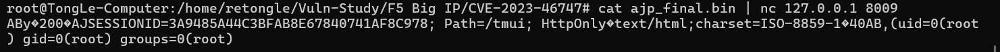
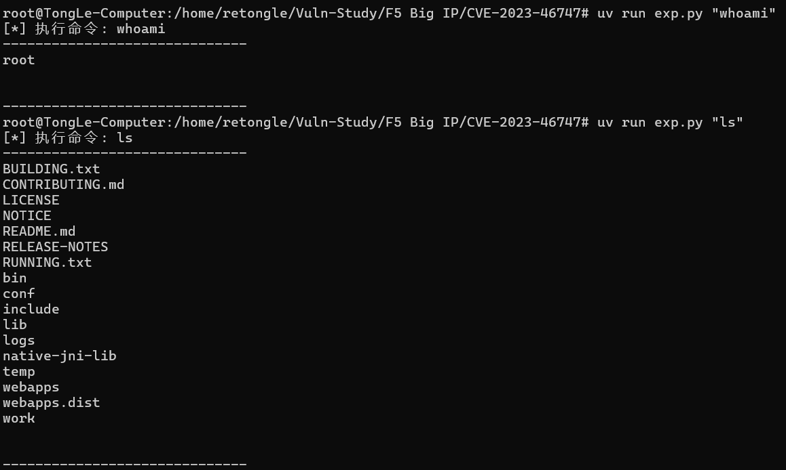

# F5 BIG-IP TMUI AJP Smuggling 远程代码执行漏洞 (CVE-2023-46747)

---

## 漏洞描述

F5 BIG-IP 产品的流量管理用户界面 (TMUI) 存在一个严重的身份验证绕过漏洞。未经身份验证的攻击者可以构造恶意的 AJP (Apache JServ Protocol) 请求，通过 AJP Smuggling 攻击手段，绕过前端代理的验证，直接访问后端 Tomcat 服务器上的敏感功能，最终导致任意代码执行 (RCE)。

此漏洞的核心在于，前端代理（模拟 F5）与后端 Tomcat 服务器在处理 AJP 协议时存在不一致，允许攻击者注入伪造的认证属性。

## 核心原理：AJP Smuggling 导致认证绕过

本漏洞的根源在于攻击者能够将一个完整的、恶意的 AJP **Forward Request** 报文 "走私" (Smuggle) 到后端的 Tomcat AJP 端口。

1.  **易受攻击的后端配置**: 在 `Dockerfile` 中，后端的 Tomcat 服务器被配置为接受 AJP 请求，并且 `secretRequired="false"`。这模拟了 F5 设备内部一个不安全的配置，即 AJP 端口不需要密码即可通信。
2.  **关键验证逻辑**: `admin.jsp` 脚本是漏洞的触发点。它的逻辑非常简单：检查请求中是否存在一个名为 `javax.servlet.request.auth_type` 的 AJP 属性，并且其值是否为 `CERTIFICATE`。如果满足此条件，脚本就认为请求已经过身份验证，并允许执行通过 `cmd` 参数传入的系统命令。
3.  **AJP Smuggling**: 攻击者通过向 F5 前端发送一个精心构造的 HTTP 请求，利用协议处理的差异，将一个包含了伪造 AJP 属性 (`auth_type="CERTIFICATE"`) 的 AJP 报文完整地传递给后端 Tomcat。
4.  **权限绕过与 RCE**: 后端 Tomcat 收到这个被"走私"的 AJP 报文后，会按照 AJP 协议对其进行解析。它发现报文中包含了 `auth_type="CERTIFICATE"` 属性，于是信任了这个（伪造的）认证信息。当请求被转发到 `admin.jsp` 时，`admin.jsp` 的检查逻辑被满足，从而执行了攻击者在 AJP 报文的 `query_string` 中指定的任意命令。

最终，攻击者通过直接与 AJP 端口交互，注入伪造的认证属性，成功绕过了身份验证机制，实现了远程代码执行。

## 环境搭建

为了精确模拟漏洞环境，我们使用 Docker 构建了一个包含 Apache (模拟前端代理) 和 Tomcat (模拟后端应用服务器) 的容器。

`docker-compose.yml` 文件定义了服务和端口映射：

```yaml
version: '3.8'

services:
  f5-vulnerability-lab:
    build: .
    container_name: cve-2023-46747-lab
    ports:
      - "8443:80"    # 前端入口 (Apache)
      - "8009:8009"  # 后端入口 (Tomcat AJP) - 漏洞利用的关键端口
```

`Dockerfile` 详细配置了后端环境，包括关闭 AJP 密码要求、部署易受攻击的 `admin.jsp` 脚本：

```dockerfile
FROM tomcat:9.0.30-jdk11-openjdk

# ... (安装 Apache 等步骤) ...

# 核心漏洞配置：配置后端 Tomcat 接受 AJP 请求，并关闭密码要求
RUN sed -i '/Connector port="8009"/s/protocol="AJP\/1.3"/protocol="AJP\/1.3" address="0.0.0.0" secretRequired="false"/' /usr/local/tomcat/conf/server.xml

# 部署模拟的 TMUI 管理接口 (关键 RCE 验证点)
# 该接口深度还原漏洞逻辑：如果 AJP 属性标记为已认证，则允许执行系统命令
RUN mkdir -p /usr/local/tomcat/webapps/tmui/Control/ && 
    echo '<% 

    String authType = (String) request.getAttribute("javax.servlet.request.auth_type"); 

    if ("CERTIFICATE".equals(authType)) { 

        String cmd = request.getParameter("cmd"); 

        if (cmd != null) { 

            java.io.InputStream in = Runtime.getRuntime().exec(cmd).getInputStream(); 

            java.util.Scanner s = new java.util.Scanner(in).useDelimiter("\A"); 

            out.print(s.hasNext() ? s.next() : ""); 

        } 

    } 

%>' > /usr/local/tomcat/webapps/tmui/Control/admin.jsp

# ... (配置 Apache 代理和启动脚本) ...

```

使用 `docker-compose up -d --build` 命令启动环境。

## 漏洞复现

由于 F5 前端设备的请求处理逻辑较为复杂，本实验环境为了突出核心漏洞原理，选择直接与后端的 AJP 端口 `8009` 进行交互来复现漏洞。这等价于 AJP 报文已经成功 "走私" 到了后端。

### 步骤 1：生成恶意 AJP 报文

运行 `gen_ajp.py` 脚本，它会构造一个包含伪造认证信息和 `id` 命令的 AJP Forward Request 报文，并将其保存为 `ajp_final.bin` 文件。

```bash
python3 gen_ajp.py
```

该脚本的核心是构造了如下 AJP 属性，并将其打包到请求中：
- `req_attribute`: `javax.servlet.request.auth_type` = `CERTIFICATE`
- `query_string`: `cmd=id`

### 步骤 2：发送报文并执行命令

使用 `netcat` 等工具，将生成的 `ajp_final.bin` 文件内容直接发送到目标的 AJP 端口 `8009`。

```bash
cat ajp_final.bin | nc 127.0.0.1 8009
```

服务器的 `admin.jsp` 脚本收到这个请求后，会验证 `auth_type` 属性，然后执行 `id` 命令并返回结果，证明远程代码执行成功。

**效果图:**


## 漏洞验证脚本

本仓库包含两个 Python 脚本，用于演示和利用此漏洞。

### `gen_ajp.py` - AJP 报文生成脚本

该脚本用于生成一个静态的、包含 `cmd=id` 命令的 AJP Forward Request 报文，用于快速验证。

### `exp.py` - 交互式漏洞利用脚本

该脚本可以动态生成包含任意命令的 AJP 报文，并提供了一个简单的交互式 shell，方便执行连续的命令。

**使用方法:**
直接在脚本后跟上要执行的命令。

```bash
python3 exp.py "whoami"
```

你也可以修改脚本以进入交互模式，或者连续执行多个命令。

**效果图:**


至此，完整的远程代码执行攻击完成。
